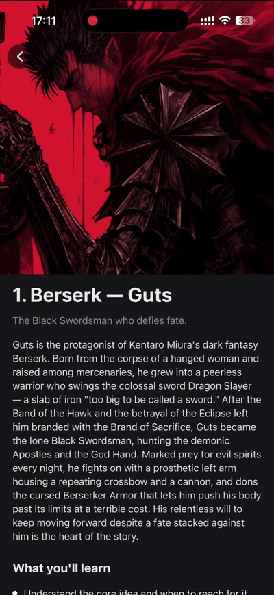

# @ekosha-dev/react-native-animated-header-scroll-view

A lightweight React Native `ScrollView` with an animated, collapsing header.

As you scroll, the large header content scales and slides away, and a compact sticky header fades in. Everything runs on the **native thread**, so it stays smooth — and there are **no extra dependencies**: no `reanimated`, no `gesture-handler`, no `safe-area-context`.

<p>
  
</p>

## Installation

```bash
npm install @ekosha-dev/react-native-animated-header-scroll-view
# or
yarn add @ekosha-dev/react-native-animated-header-scroll-view
```

That's it. Safe-area insets (status bar / notch) are handled for you using built-in APIs — core `SafeAreaView` on iOS and `StatusBar.currentHeight` on Android.

## Usage

```tsx
import { AnimatedHeaderScrollView } from '@ekosha-dev/react-native-animated-header-scroll-view'
import { Text, View } from 'react-native'

const Example = () => (
  <AnimatedHeaderScrollView
    topHeaderComponent={<Text>Top Header</Text>}
    scrolledHeaderComponent={<Text>Scrolled Header</Text>}
    contentComponent={<Text>Animated Content</Text>}
    useSafeArea
  >
    <View>
      <Text>Static content goes here</Text>
    </View>
  </AnimatedHeaderScrollView>
)
```

## How it works

The component is made of four parts. The first two are headers pinned to the top of the screen; the last two scroll normally:

- **`topHeaderComponent`** — the big header you see at the top. It fades out as you scroll down.
- **`scrolledHeaderComponent`** — a compact sticky header that fades in once you've scrolled past the content. It stays pinned at the top.
- **`contentComponent`** — the content right under the header (e.g. a banner image). It scales and slides as you scroll, creating the parallax effect.
- **`children`** — your regular page content, rendered below and scrolling as usual.

The switch from the top header to the sticky header happens automatically once `contentComponent` has scrolled out of view.

## Props

In addition to every standard [`ScrollView`](https://reactnative.dev/docs/scrollview#props) prop, the component accepts:

| Prop                      | Type         | Default | Description                                                                   |
| ------------------------- | ------------ | ------- | ----------------------------------------------------------------------------- |
| `topHeaderComponent`      | `ReactNode`  | —       | Large header shown at the top; fades out while scrolling down.                |
| `scrolledHeaderComponent` | `ReactNode`  | —       | Compact sticky header; fades in after `contentComponent` scrolls out of view. |
| `contentComponent`        | `ReactNode`  | —       | Content that scales and slides as you scroll (the parallax element).          |
| `children`                | `ReactNode`  | —       | Regular content rendered below `contentComponent`.                            |
| `scaleMin`                | `number`     | `0.7`   | How small `contentComponent` shrinks while scrolling up (`0.7` = 70%).        |
| `fitContentWidth`         | `boolean`    | `true`  | Keep `contentComponent` full-width as it shrinks, so it never leaves gaps.    |
| `headerBackgroundColor`   | `ColorValue` | —       | Background color of the sticky header (also fills the safe-area inset).       |
| `useSafeArea`             | `boolean`    | `false` | Add top safe-area padding (status bar / notch) to the headers.                |

## Full-width content (no gaps)

When `contentComponent` shrinks below full size (`scaleMin < 1`), a plain scale would leave empty space on its sides. The library prevents this **automatically** — it widens the content so it still fills the screen at minimum scale. No `Dimensions` math on your side.

The only requirement is that your content stretches to fill the width, e.g.:

```tsx
contentComponent={<Image source={...} style={{ width: '100%', height: 250 }} />}
```

To turn this off, pass `fitContentWidth={false}`.

## License

Released under the **ISC License** © Yeldos Turapbayev. You're free to use, modify and distribute it. See the [LICENSE](https://github.com/ekosha-dev/react-native-animated-header-scroll-view/blob/main/LICENSE) file for the full text.
